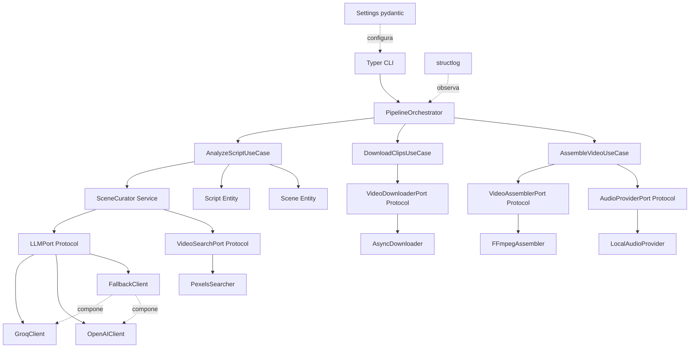

# LAVOX

Pipeline automatizado de creación de video: **guion → análisis narrativo con
LLM → curación semántica de video de stock (Pexels) → descarga concurrente →
ensamblaje con FFmpeg → video final.**

Este repositorio es el refactor a nivel producción del prototipo original
(`config.py`, `ejercicio1.py`, `curador_ia.py`, ...): mismo comportamiento y
mismos prompts, pero reorganizado en Clean Architecture, sin secretos en el
código, completamente async, tipado estricto y con una suite de tests real.

---

## ⚠️ Seguridad — acción requerida antes de usar este repo

El `config.py` original tenía **tres API keys reales hardcodeadas** (Groq,
Pexels y OpenAI). Si vienes de ese código:

1. **Rota las tres keys ya mismo** en sus respectivos dashboards (Groq,
   Pexels, OpenAI). Trátalas como comprometidas.
2. Nunca vuelvas a poner una key real en un archivo que se vaya a commitear.
   Este proyecto las lee exclusivamente desde variables de entorno (ver
   [Configuración](#configuración)).
3. Revisa el historial de git de tu repositorio original: si ese
   `config.py` se llegó a commitear alguna vez, las keys quedaron en el
   historial aunque hoy el archivo ya no exista. Considera reescribir el
   historial (`git filter-repo` / BFG) además de rotarlas.

---

## Índice

- [Arquitectura](#arquitectura)
- [Requisitos](#requisitos)
- [Instalación](#instalación)
- [Configuración](#configuración)
- [Uso](#uso)
- [Desarrollo](#desarrollo)
- [Troubleshooting](#troubleshooting)
- [Contribución](#contribución)
- [Changelog](#changelog)

---

## Arquitectura

El proyecto sigue Clean Architecture con tres capas y separación estricta de
dependencias (el dominio no importa nada de infraestructura):

- **`domain/`** — entidades (`Scene`, `Clip`, `Script`), puertos (`Protocol`:
  `LLMPort`, `VideoSearchPort`, `VideoDownloaderPort`, `VideoAssemblerPort`,
  `AudioProviderPort`), el servicio `SceneCurator` y la jerarquía de
  excepciones. No depende de ningún SDK ni framework externo.
- **`application/`** — casos de uso (`AnalyzeScriptUseCase`,
  `DownloadClipsUseCase`, `AssembleVideoUseCase`) y el
  `PipelineOrchestrator` que los encadena. Depende solo de los puertos del
  dominio, nunca de una implementación concreta.
- **`infrastructure/`** — adaptadores concretos: `GroqClient` /
  `OpenAIClient` / `FallbackClient` (LLM), `PexelsSearcher` (búsqueda de
  video), `AsyncDownloader` (descarga), `FFmpegAssembler` (ensamblaje) y
  `LocalAudioProvider` (duración de audio vía `ffprobe`).
- **`cli/`** — Typer + Rich. Es el único módulo que conoce tanto los casos
  de uso como las implementaciones concretas: actúa como *composition
  root*, construyendo la infraestructura a partir de `Settings` e
  inyectándola en los casos de uso.



### Decisiones de diseño relevantes

- **El checkpoint (`escenas_con_videos.json`) es compatible hacia atrás.**
  `Scene.to_dict()` / `Scene.from_dict()` usan exactamente el mismo esquema
  JSON que la versión original, así que un checkpoint ya generado sigue
  siendo un punto de reanudación válido: no se vuelve a gastar presupuesto
  de LLM/Pexels en escenas ya procesadas.
- **`ffprobe` reemplaza a `moviepy`** para leer duraciones (tanto de audio
  como de cada clip). El original usaba `moviepy` solo para dos cosas
  triviales (duración de audio y localizar el binario de `ffmpeg`); ambas
  se resuelven ahora sin esa dependencia pesada, con `ffprobe -show_format
  -print_format json`, más robusto que parsear la salida de texto de
  `ffmpeg`.
- **Una sola política de reintentos.** El `max_retries` interno de los SDKs
  de Groq/OpenAI se desactiva explícitamente; todos los reintentos
  (LLM, Pexels, descargas) pasan por `tenacity` con backoff exponencial y
  jitter configurables, en vez de tener dos capas de reintento superpuestas.
- **`FallbackClient` no sabe nada de Groq ni de OpenAI.** Cada proveedor
  solo sabe llamar a su propia API; la política "Groq primero, OpenAI como
  respaldo" vive en un componente separado que implementa el mismo
  `LLMPort`, así que se puede usar en cualquier orden o combinación.
  `AsyncDownloader.download_many` acota concurrencia con
  `asyncio.Semaphore` + `asyncio.gather(..., return_exceptions=True)`, sin
  que un fallo individual cancele el resto.

## Requisitos

- Python **3.11+**
- [`uv`](https://docs.astral.sh/uv/) (gestor de paquetes/entornos)
- `ffmpeg` y `ffprobe` en el `PATH` (o configurables vía `LAVOX_FFMPEG__*`)
- API keys de **Groq** y/o **OpenAI**, y de **Pexels**

## Instalación

```bash
uv sync                       # instala dependencias + dev tools en .venv
cp .env.example .env          # completa tus propias keys
```

## Configuración

Toda la configuración vive en `src/lavox/settings.py` (`pydantic-settings`),
con esta precedencia (de menor a mayor prioridad):

```
valores por defecto  →  .env  →  variables de entorno reales  →  flags de la CLI
```

Las variables usan el prefijo `LAVOX_`, y `__` (doble guion bajo) para
anidar (`LAVOX_LLM__GROQ_API_KEY`, `LAVOX_PIPELINE__RELEVANCE_THRESHOLD`,
...). Ver [`.env.example`](.env.example) para la lista completa, comentada,
de todas las variables soportadas.

Las API keys se exponen como `pydantic.SecretStr`: nunca aparecen en un
`repr()`, en un log, ni en un traceback por accidente.

## Uso

```bash
# Pipeline completo
uv run lavox-pipeline run --guion guion.txt

# Solo una fase
uv run lavox-pipeline analyze --guion guion.txt
uv run lavox-pipeline download --workers 8
uv run lavox-pipeline assemble --audio audios/narracion.mp3

# Validar configuración y ver el plan, sin llamar a ningún proveedor externo
uv run lavox-pipeline run --guion guion.txt --dry-run

# Scripts standalone equivalentes (instalados por pyproject.toml)
uv run lavox-analyze --guion guion.txt
uv run lavox-download --workers 8
uv run lavox-assemble --audio audios/narracion.mp3
```

### Flags principales

| Flag | Comandos | Descripción |
|---|---|---|
| `--guion` | `analyze`, `run` | Ruta del guion de entrada |
| `--output` | todos | Salida del comando (checkpoint, carpeta de clips o video final, según el comando) |
| `--workers` | `download`, `run` | Descargas concurrentes máximas |
| `--max-relevance` | `analyze`, `run` | Umbral de relevancia (0-100) para aceptar un clip |
| `--resume` / `--no-resume` | `analyze`, `run` | Reanudar desde un checkpoint existente (default: sí) |
| `--dry-run` | todos | Valida configuración/entradas sin llamar proveedores externos |

### Códigos de salida

| Código | Significado |
|---|---|
| `0` | Éxito completo |
| `1` | Error de configuración (falta un archivo, una API key, etc.) |
| `2` | Error del proveedor LLM |
| `3` | Error de descarga (fallo catastrófico: ninguna descarga tuvo éxito) |
| `4` | Error de ensamblaje (FFmpeg) |
| `5` | Éxito parcial: se generó un resultado, pero degradado (alguna escena sin clip o alguna descarga individual fallida) |

## Desarrollo

```bash
uv sync --group dev
uv run ruff check . && uv run ruff format --check .
uv run mypy --strict src
uv run pytest --cov=src --cov-fail-under=85
uv build
uv run pre-commit install   # opcional: corre los hooks en cada commit
```

## Troubleshooting

**`ConfigError: No hay ninguna API key de LLM configurada`**
Falta `LAVOX_LLM__GROQ_API_KEY` y/o `LAVOX_LLM__OPENAI_API_KEY` en tu
`.env`. Se necesita al menos una de las dos.

**`AssemblyError: No se encontró el ejecutable 'ffmpeg'`**
`ffmpeg`/`ffprobe` no están en el `PATH`. Instálalos (`apt install ffmpeg`
en Debian/Ubuntu) o apunta `LAVOX_FFMPEG__BINARY` /
`LAVOX_FFMPEG__PROBE_BINARY` a su ruta absoluta.

**El pipeline se reinicia desde cero en vez de continuar**
Verifica que `--resume` esté activo (es el default) y que
`LAVOX_SCENES_OUTPUT_PATH` apunte al mismo checkpoint que usaste antes.

**Salida parcial (código 5) con muchas escenas sin clip**
Sube `--max-relevance` a un valor más permisivo, o revisa que
`LAVOX_PIPELINE__CONTEXTO_NARRATIVO` describa bien el tema real de tu
guion: el LLM usa ese contexto para generar los `elementos_clave` con los
que se arma cada query de búsqueda.

**Rate limit de Pexels (429) constante**
Baja `LAVOX_PIPELINE__MAX_DOWNLOAD_CONCURRENCY` y/o
`LAVOX_PEXELS__PER_PAGE`; Pexels limita peticiones por minuto según tu plan.

## Contribución

1. `uv sync --group dev && uv run pre-commit install`
2. Antes de un PR: `ruff check . && ruff format --check . && mypy --strict src && pytest --cov=src --cov-fail-under=85`
3. Sigue Clean Architecture: el dominio no importa infraestructura; los
   casos de uso solo dependen de puertos (`Protocol`), nunca de
   implementaciones concretas.
4. Cualquier prompt nuevo o modificado hacia un LLM va en la capa que ya
   posee ese prompt (`SceneCurator` o `AnalyzeScriptUseCase`), no en
   infraestructura.

## Changelog

Ver [`CHANGELOG.md`](CHANGELOG.md).

## Licencia

MIT.
